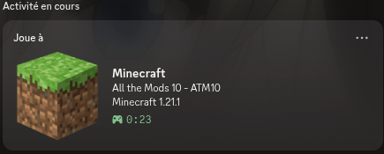

# prism-discord-rpc

A simple tool to automatically display your Minecraft instance and playtime from Prism Launcher on Discord.



# Build

> [!IMPORTANT]
> Discord must be running for the Rich Presence to work.

1. Clone the repository
```bash
git clone https://github.com/Lunyyx/prism-discord-rpc.git
```

2. Open the project directory
```bash
cd prism-discord-rpc
```

3. Build the project
```bash
cargo build --release
```

4. Execute the project
```bash
./target/release/prism-discord-rpc
```

# Configuration

The configuration file is located at:
```
~/.config/prism-discord-rpc/config.toml
```

> [!WARNING]
> You are responsible for the text displayed through this tool. Using offensive, illegal, or otherwise prohibited text may result in action being taken against your Discord account.

## `[discord_activity]`
| Option | Description | Example |
|---|---|---|
| `name` | Name displayed in the Rich Presence. Supports variables. | `"Minecraft"` |
| `details` | Details displayed in the Rich Presence. Supports variables. | `"Playing {{ minecraft_version }}"` |
| `state` | State displayed in the Rich Presence. Supports variables. | `"{{ profile_name }}"` |

### Available variables

| Variable | Description |
|---|---|
| `{{ minecraft_version }}` | Minecraft version |
| `{{ profile_name }}` | Instance/profile name |

### Examples

```toml
[discord_activity]
name = "Minecraft"
details = "{{ minecraft_version }}"
state = "{{ profile_name }}"
```

This will display:

```
Minecraft
1.21.1
ATM10
```

You can freely combine and order variables:
```
[discord_activity]
name = "{{ minecraft }} - {{ minecraft_version }}"
details = "Playing {{ profile_name }}"
state = "Prism Launcher"
```

This will display:
```
Minecraft - 1.21.1
Playing ATM10
Prism Launcher
```
